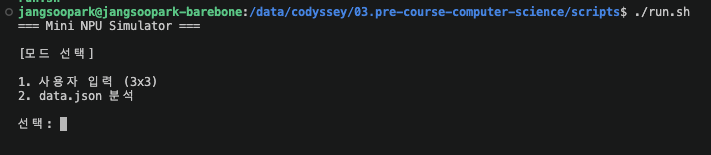
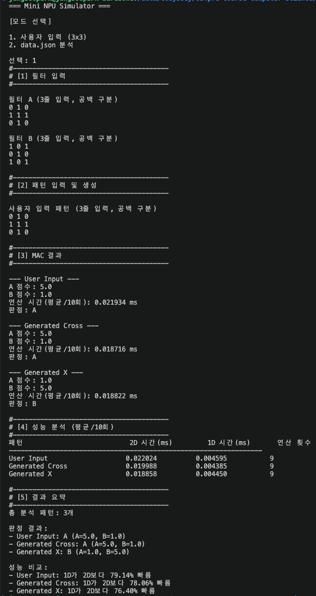
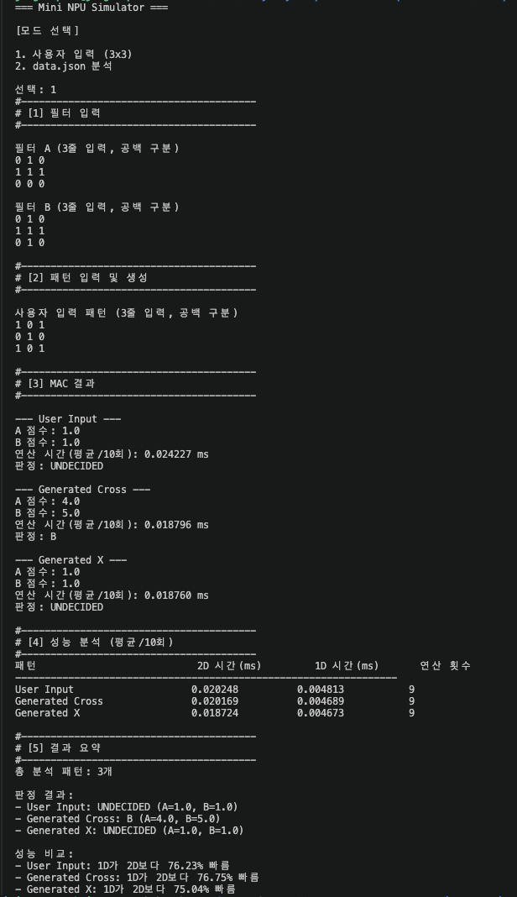
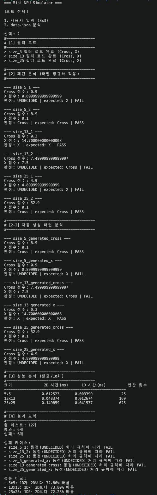
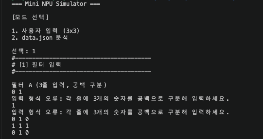
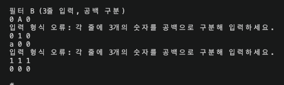
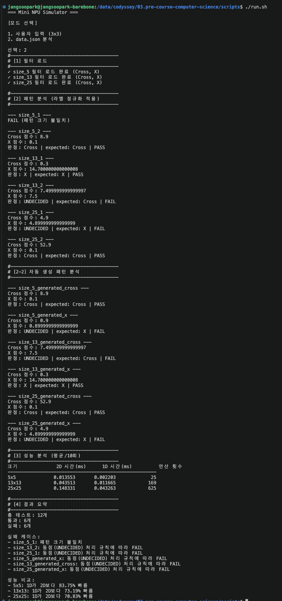
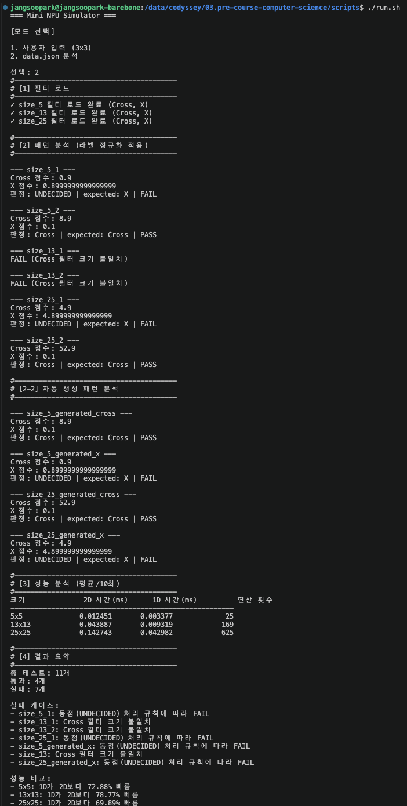
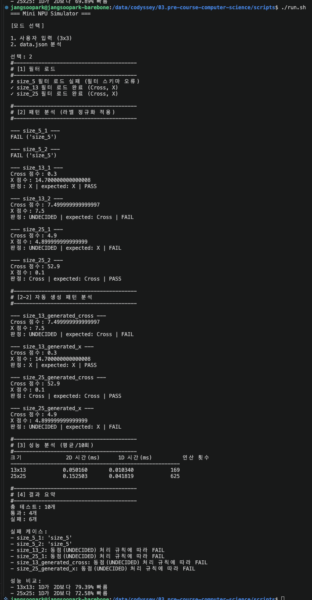

# Mini NPU Simulator

## 개요

본 프로젝트에서는 AI 연산의 핵심 연산인 MAC(Multiply-Accumulate)의 동작 원리를 이해하고, 입력 데이터의 크기와 데이터 접근 방식에 따른 연산 특성을 분석하기 위한 Mini NPU Simulator를 구현한다.  
패턴과 필터를 2차원 숫자 배열로 표현하고 동일한 위치의 원소를 곱하여 누적한 MAC 점수를 기반으로 Cross와 X 패턴을 판별하며, 부동소수점 연산에서 발생할 수 있는 오차를 고려하여 epsilon 기반의 비교 정책을 적용한다.  
구현에는 외부 행렬 연산 라이브러리를 사용하지 않고 Python의 기본 자료구조와 반복문만을 사용하며, 사용자로부터 입력받은 3×3 데이터와 JSON 파일로 제공되는 5×5, 13×13, 25×25 데이터를 대상으로 동작을 검증한다.  
또한 입력 크기에 따른 연산 횟수와 실행 시간을 측정하여 MAC 연산의 시간 복잡도를 분석하고, 2차원 배열을 1차원 배열로 변환한 구현과의 성능 비교를 통해 데이터 접근 방식에 따른 차이를 확인한다.  
추가로 임의 크기의 Cross와 X 패턴을 자동으로 생성하는 패턴 생성기를 구현하여 패턴 판별과 성능 분석에 활용한다.

## 목차

1. [개요](#개요)
2. [프로젝트 구조](#2-프로젝트-구조)
3. [개발 환경](#3-개발-환경)
4. [실행 방법](#4-실행-방법)
5. [주요 구현](#5-주요-구현)
   - [5.1 Matrix](#51-matrix)
   - [5.2 MAC 연산](#52-mac-연산)
   - [5.3 라벨 정규화](#53-라벨-정규화)
   - [5.4 Epsilon 기반 판정](#54-epsilon-기반-판정)
6. [사용자 입력 모드](#6-사용자-입력-모드)
7. [JSON 데이터 분석 모드](#7-json-데이터-분석-모드)
8. [성능 분석](#8-성능-분석)
9. [보너스 구현](#9-보너스-구현)
   - [9.1 1차원 데이터 접근 최적화](#91-1차원-데이터-접근-최적화)
   - [9.2 Cross / X 패턴 생성기](#92-cross--x-패턴-생성기)
10. [결과 리포트](#10-결과-리포트)
    - [10.1 테스트 결과](#101-테스트-결과)
    - [10.2 실패 케이스 분석](#102-실패-케이스-분석)
    - [10.3 성능 측정 결과](#103-성능-측정-결과)
    - [10.4 시간 복잡도 분석](#104-시간-복잡도-분석)
    - [10.5 2D / 1D 성능 비교](#105-2d--1d-성능-비교)
11. [결론](#11-결론)

## 2. 프로젝트 구조

```text
03.pre-course-computer-science/
├── data/
│   └── data.json
├── scripts/
│   └── run.sh
├── src/
│   ├── common/
│   │   ├── __init__.py
│   │   ├── definitions.py
│   │   └── utils.py
│   ├── npu/
│   │   ├── __init__.py
│   │   ├── benchmark.py
│   │   ├── generator.py
│   │   ├── matrix.py
│   │   └── simulator.py
│   ├── application.py
│   └── main.py
└── README.md
```

프로그램은 역할에 따라 데이터 구조, 연산, 성능 측정, 패턴 생성 및 애플리케이션 실행 영역으로 분리하여 구성한다.

- `main.py`: 프로그램의 진입점으로 실행 인자와 데이터 파일 경로를 처리한다.
- `application.py`: 사용자 입력 및 JSON 데이터 분석을 포함한 전체 프로그램의 실행 흐름을 관리한다.
- `matrix.py`: 2차원 패턴과 필터를 표현하는 `Matrix` 자료구조를 정의한다.
- `simulator.py`: 2D/1D MAC 연산과 epsilon 기반 점수 비교를 수행한다.
- `benchmark.py`: MAC 연산을 반복 실행하여 평균 연산 시간을 측정한다.
- `generator.py`: 임의 크기의 Cross 및 X 패턴을 생성한다.
- `utils.py`: 사용자 입력, JSON 파일 로드, 라벨 정규화 등의 공통 기능을 제공한다.

## 3. 개발 환경

본 프로젝트는 별도의 외부 라이브러리 없이 Python 표준 라이브러리만을 이용하여 구현한다.

| 항목 | 환경 |
| --- | --- |
| Language | Python >= 3.8.x |
| External Library | 사용하지 않음 |
| Data Format | JSON |
| Execution | CLI |

## 4. 실행 방법

프로젝트의 `src/main.py`를 실행한다.

```bash
python src/main.py
```

데이터 파일을 실행 인자로 지정하는 경우 다음과 같이 실행한다.

```bash
python src/main.py --data-path <DATA_PATH>
```

프로그램을 실행하면 사용자 입력과 JSON 데이터 분석 중 하나의 모드를 선택할 수 있다.


```text
=== Mini NPU Simulator ===

[모드 선택]

1. 사용자 입력 (3x3)
2. data.json 분석

선택:
```

## 5. 주요 구현

### 5.1 Matrix

패턴과 필터는 행과 열을 가지는 2차원 데이터이므로 이를 표현하기 위한 `Matrix` 클래스를 구현한다.  
`Matrix`는 내부적으로 Python의 `list`를 이용하여 데이터를 저장하며 행과 열의 크기를 관리한다.  
`[]` 연산자를 이용하여 특정 위치의 데이터에 접근할 수 있도록 구성하여 MAC 연산에서 일반적인 2차원 배열과 동일한 방식으로 사용할 수 있도록 한다.  
또한 보너스 과제의 1차원 데이터 접근 방식에서 사용할 수 있도록 2차원 행렬을 길이 `N²`의 1차원 배열로 변환할 수 있도록 구성한다.

### 5.2 MAC 연산

MAC(Multiply-Accumulate)은 두 데이터의 동일한 위치에 존재하는 값을 곱하고 그 결과를 하나의 값으로 누적하는 연산이다.  
N×N 크기의 패턴 `P`와 필터 `F`에 대한 MAC 점수는 다음과 같이 표현할 수 있다.

$$
S = \sum_{i=0}^{N-1}\sum_{j=0}^{N-1} P_{i,j}F_{i,j}
$$

예를 들어 Cross 패턴과 Cross 필터에 MAC 연산을 적용하면 다음과 같다.

```text
0 1 0       0 1 0
1 1 1   ×   1 1 1
0 1 0       0 1 0

Score = 5
```

본 구현에서는 NumPy와 같은 외부 행렬 연산 라이브러리를 사용하지 않고 중첩 반복문을 이용하여 각 원소의 곱셈과 누적 연산을 직접 수행한다.  
패턴과 필터의 크기가 서로 다른 경우 정상적인 MAC 연산을 수행할 수 없으므로 연산 전에 두 데이터의 크기가 같은지 검증한다.

### 5.3 라벨 정규화

JSON 데이터에서 사용되는 라벨과 프로그램 내부에서 사용하는 라벨의 표현을 통일하기 위해 라벨 정규화를 수행한다.  
프로그램 내부에서는 `Cross`와 `X`를 표준 라벨로 사용한다.

| 입력 라벨 | 표준 라벨 |
| --- | --- |
| `+` | `Cross` |
| `cross` | `Cross` |
| `x` | `X` |

입력 데이터의 표현과 내부 판정 결과를 동일한 표준 라벨로 변환함으로써 문자열 표현의 차이로 인해 PASS/FAIL 판정이 달라지는 문제를 방지한다.

### 5.4 Epsilon 기반 판정

부동소수점은 실수를 유한한 비트로 표현하기 때문에 계산 과정에서 미세한 오차가 발생할 수 있다.  
예를 들어 수학적으로 동일하다고 볼 수 있는 두 점수가 다음과 같이 표현될 수 있다.

```text
0.9000000000000000
0.8999999999999999
```

이를 단순한 대소 비교로 처리하면 매우 작은 부동소수점 오차가 최종 판정에 영향을 줄 수 있다.  
따라서 두 점수의 차이가 설정한 허용오차 `epsilon`보다 작은 경우 동점으로 판단한다.

```python
abs(score_a - score_b) < epsilon
```

본 구현에서는 기본적으로 `1e-9`를 epsilon으로 사용하며, 해당 조건을 만족하면 결과를 `UNDECIDED`로 처리한다.

## 6. 사용자 입력 모드

사용자 입력 모드에서는 3×3 크기의 필터 A, 필터 B와 판별할 패턴을 콘솔에서 직접 입력받는다.  
각 행은 공백으로 구분된 세 개의 숫자로 입력하며, 총 세 개의 행을 입력하여 하나의 3×3 행렬을 구성한다.  
입력 과정에서는 행과 열의 개수 및 숫자 변환 가능 여부를 검증하며, 잘못된 입력이 발생하면 프로그램을 종료하지 않고 재입력을 유도한다.  
입력이 완료되면 사용자 입력 패턴과 두 필터 사이의 MAC 점수를 계산하고 점수가 높은 필터를 최종 결과로 판정한다. 두 점수의 차이가 epsilon보다 작은 경우에는 `UNDECIDED`로 판정한다.  
패턴 생성기를 통해 생성한 3×3 Cross 및 X 패턴도 동일한 필터에 입력하여 사용자 입력 패턴과 함께 분석한다.

### 6.1 정상 입력

사용자 입력 패턴


```text
[사용자 입력 패턴 / Generated Cross / Generated X 실제 실행 결과 삽입]
```

### 6.2 열 개수 오류

3×3 행렬을 입력하는 과정에서 한 행에 세 개가 아닌 값이 입력된 경우 입력 형식 오류로 처리한다.

```text
필터 A
0 1
입력 형식 오류: 각 줄에 3개의 숫자를 공백으로 구분해 입력하세요.
```

잘못된 입력으로 인해 프로그램을 종료하지 않고 해당 행을 다시 입력받는다.

### 6.3 숫자 변환 오류

숫자로 변환할 수 없는 문자열이 입력된 경우에도 오류 메시지를 출력하고 재입력을 요청한다.

```text
필터 A
0 A 0
입력 형식 오류: 각 줄에 3개의 숫자를 공백으로 구분해 입력하세요.
```

이를 통해 잘못된 사용자 입력이 MAC 연산 단계까지 전달되지 않도록 한다.

### 6.4 Epsilon 기반 동점 처리

두 필터의 MAC 점수가 매우 유사한 경우 단순한 대소 비교를 수행하지 않고 epsilon을 이용하여 동점 여부를 판정한다.

```text
A 점수: 0.9000000000000000
B 점수: 0.8999999999999999
판정: UNDECIDED
```

두 점수의 차이가 `1e-9`보다 작으므로 부동소수점 표현상의 미세한 차이를 무시하고 `UNDECIDED`로 처리한다.

## 7. JSON 데이터 분석 모드

JSON 데이터 분석 모드에서는 지정된 JSON 파일에서 필터와 테스트 패턴을 읽어 일괄적으로 분석한다.  
JSON 데이터는 크게 `filters`와 `patterns`로 구성된다.

```text
filters
 ├─ size_5
 ├─ size_13
 └─ size_25

patterns
 ├─ size_5_1
 ├─ size_5_2
 ├─ size_13_1
 └─ ...
```

패턴의 키는 `size_{N}_{idx}` 규칙을 사용하므로 키에서 `N`을 추출하여 동일한 크기의 `size_N` 필터를 선택한다.  
각 패턴을 분석하기 전에 패턴과 Cross/X 필터의 크기가 동일한지 확인한다. 패턴의 크기, 필터의 크기 또는 JSON 스키마에 문제가 있는 경우 프로그램 전체를 종료하지 않고 해당 테스트 케이스만 FAIL로 처리한다.  
검증을 통과한 패턴은 Cross 및 X 필터와 각각 MAC 연산을 수행한다. 두 점수를 비교하여 `Cross`, `X`, `UNDECIDED` 중 하나로 판정하고, 정규화된 `expected` 라벨과 비교하여 PASS/FAIL을 결정한다.  
JSON 데이터에 포함된 패턴뿐만 아니라 각 크기에 대해 패턴 생성기로 생성한 Cross 및 X 패턴도 분석에 포함한다.

### 7.1 정상 데이터 분석

```text
--- size_5_2 ---
Cross 점수: 8.9
X 점수: 0.1
판정: Cross | expected: Cross | PASS
```

### 7.2 Epsilon에 의한 FAIL

```text
--- size_5_1 ---
Cross 점수: 0.9
X 점수: 0.8999999999999999
판정: UNDECIDED | expected: X | FAIL
```

두 점수의 차이가 epsilon보다 작으므로 동점으로 처리한다. 따라서 `expected`가 X인 경우 최종 결과는 FAIL이 된다.

### 7.3 패턴 크기 불일치

```text
--- size_5_1 ---
FAIL (패턴 크기 불일치)
```

오류가 발생한 테스트만 실패로 기록하고 이후 테스트는 계속 수행한다.

### 7.4 필터 크기 불일치

```text
--- size_13_1 ---
FAIL (Cross 필터 크기 불일치)
```

패턴과 필터의 크기가 서로 다른 경우 MAC 연산을 수행하지 않고 FAIL로 처리한다.

### 7.5 JSON 스키마 오류

```text
✗ size_5 필터 로드 실패 (필터 스키마 오류)
```

필터의 `cross`, `x` 또는 패턴의 `input`, `expected`와 같은 필수 데이터가 올바르지 않은 경우 해당 필터 또는 테스트 케이스를 오류로 처리한다.

### 7.6 자동 생성 패턴 분석

```text
--- size_13_generated_cross ---
Cross 점수: ...
X 점수: ...
판정: Cross | expected: Cross | PASS

--- size_13_generated_x ---
Cross 점수: ...
X 점수: ...
판정: X | expected: X | PASS
```

자동 생성 패턴 역시 JSON에서 읽어온 패턴과 동일한 MAC 연산 및 판정 과정을 사용한다.

## 8. 성능 분석

MAC 연산의 입력 크기에 따른 실행 시간 변화를 확인하기 위해 크기별 성능을 측정한다.  
측정 과정에서는 파일 읽기나 콘솔 출력과 같은 I/O 시간을 제외하고 MAC 연산 함수가 실행되는 구간만 측정한다. 단일 실행 시간은 시스템 상태에 따라 편차가 발생할 수 있으므로 동일한 연산을 반복 수행하고 평균 시간을 사용한다.  
기본 반복 횟수는 10회로 설정한다.

| 크기 | MAC 연산 횟수 |
| ---: | ---: |
| 3×3 | 9 |
| 5×5 | 25 |
| 13×13 | 169 |
| 25×25 | 625 |

각 크기에 대해 2차원 접근 방식과 1차원 접근 방식의 MAC 연산 시간을 동일한 조건에서 측정한다.

## 9. 보너스 구현

### 9.1 1차원 데이터 접근 최적화

기본 MAC 구현에서는 N×N 데이터를 2차원 List 형태로 유지하고 다음과 같이 두 개의 인덱스를 이용하여 각 원소에 접근한다.

```python
pattern[row][col]
```

Python의 2차원 List는 실제로 하나의 연속적인 2차원 메모리 배열이 아니라, 바깥쪽 List가 각 행에 해당하는 내부 List 객체를 참조하는 구조이다. 따라서 `pattern[row][col]`에서는 먼저 `pattern[row]`을 통해 내부 List 객체를 얻은 뒤 다시 `[col]`을 통해 실제 원소를 참조한다.  
보너스 구현에서는 2차원 데이터를 길이 `N²`의 1차원 List로 변환한다.

```text
0 1 0
1 1 1
0 1 0

        ↓

0 1 0 1 1 1 0 1 0
```

변환된 데이터는 하나의 인덱스를 이용하여 접근한다.

```python
pattern[i]
```

본 구현에서의 1차원 변환은 Python List의 원소 객체 자체가 물리적으로 연속된 메모리에 배치된다는 의미의 캐시 최적화로 해석하지 않는다. Python List는 객체에 대한 참조를 저장하므로, 여기서 비교하는 핵심은 2차원 접근에서 발생하는 중첩 인덱싱과 객체 참조 단계를 1차원 접근으로 단순화하는 데 있다.  
2D 방식과 1D 방식 모두 처리해야 하는 전체 원소 수는 `N²`으로 동일하므로 시간 복잡도 역시 동일하게 `O(N²)`이다.

### 9.2 Cross / X 패턴 생성기

임의의 크기 `N`을 입력받아 N×N 크기의 Cross와 X 패턴을 자동으로 생성하는 패턴 생성기를 구현한다.  
Cross 패턴은 행렬의 중앙 행과 중앙 열을 활성화하여 생성한다.

```text
0 0 1 0 0
0 0 1 0 0
1 1 1 1 1
0 0 1 0 0
0 0 1 0 0
```

X 패턴은 주대각선과 반대 대각선을 활성화하여 생성한다.

```text
1 0 0 0 1
0 1 0 1 0
0 0 1 0 0
0 1 0 1 0
1 0 0 0 1
```

생성된 패턴은 별도의 분석 로직을 구현하지 않고 기존 MAC 연산 및 판정 과정에 입력하여 재사용한다. 이를 통해 사용자 입력 데이터와 JSON 데이터뿐만 아니라 프로그램에서 자동 생성한 패턴에 대해서도 동일한 분석 과정을 적용한다.

## 10. 결과 리포트

<details>
<summary> 실행 초기 화면 </summary>



</details>

### 10.1 테스트 결과

#### 사용자 입력 모드


<details>
<summary> 사용자 입력 모드 - 정상 </summary>



</details>

<details>
<summary> 허용 오차(Tolerance)를 이용한 판정 </summary>



</details>


#### JSON 데이터 분석 모드

```text
[전체 테스트 수 / PASS / FAIL 실제 결과 삽입]
```

프로그램의 정상 동작과 오류 처리 여부는 다음 항목을 중심으로 확인한다.

| 구분 | 테스트 내용 | 기대 결과 |
| --- | --- | --- |
| 정상 입력 | 3×3 필터와 정상 패턴 입력 | MAC 점수 및 A/B 판정 |
| 자동 생성 | Cross/X 패턴 자동 생성 | 기존 분석 과정에서 정상 판정 |
| 열 개수 오류 | 한 행에 요구된 개수와 다른 값 입력 | 오류 출력 후 재입력 |
| 숫자 오류 | 숫자가 아닌 문자열 입력 | 오류 출력 후 재입력 |
| Epsilon 동점 | 두 점수 차이가 `1e-9` 미만 | `UNDECIDED` |
| JSON 정상 데이터 | 올바른 필터 및 패턴 | PASS/FAIL 정상 출력 |
| 패턴 크기 오류 | 키의 N과 실제 크기 불일치 | 해당 케이스 FAIL |
| 필터 크기 오류 | 필터와 패턴 크기 불일치 | 해당 케이스 FAIL |
| JSON 스키마 오류 | 필수 키 누락 | 오류 처리 후 계속 실행 |
| 성능 분석 | 3×3 ~ 25×25 반복 측정 | 평균 시간 및 N² 출력 |


<details>
<summary> json 입력 모드 - 정상 </summary>



</details>


### 10.2 실패 케이스 분석

실패 케이스는 원인에 따라 데이터 및 스키마 문제, 판정 로직 문제, 부동소수점 비교 문제로 구분하여 분석한다.  
특히 Cross와 X의 MAC 점수 차이가 epsilon보다 작은 경우 실제 부동소수점 표현에는 미세한 차이가 존재하더라도 `UNDECIDED`로 처리한다. 따라서 `expected`가 `Cross` 또는 `X`인 테스트 데이터가 epsilon 범위에서 동점으로 판정되면 해당 케이스는 FAIL이 된다.  
이는 단순히 두 부동소수점 값의 대소 관계만을 이용하지 않고 수치 오차를 고려한 비교 정책을 적용한 결과이다.


#### 사용자 입력 모드 - 열 개수 불일치

<details>
<summary> 사용자 입력 모드 - 열 개수 오류 </summary>



</details>

#### 사용자 입력 모드 - 숫자 변환 실패

<details>
<summary> 사용자 입력 모드 - 숫자 변환 오류 </summary>



</details>


#### json 입력 모드  - 패턴 크기 오류

<details>
<summary> json 입력 모드 - 패턴 크기 오류 </summary>



</details>

#### json 입력 모드  - 필터 크기 오류

<details>
<summary> json 입력 모드 - 필터 크기 오류 </summary>



</details>

#### json 입력 모드  - 스키마 오류

<details>
<summary> json 입력 모드 - 스키마 오류 </summary>



</details>


### 10.3 성능 측정 결과

실제 실행 환경에서 측정한 결과를 다음 표에 정리한다.

| 크기 | 2D 평균 시간(ms) | 1D 평균 시간(ms) | 연산 횟수 |
| ---:   | ---:      |  ---:     | ---: |
| 3  ×  3  | 0.003839  | 0.000821  | 9 |
| 5  ×  5  | 0.007560  | 0.001827  | 25 |
| 13 × 13  | 0.038001  | 0.009960  | 169 |
| 25 × 25  | 0.133232  | 0.038605  | 625 |

측정 조건:

- 반복 횟수: `10000`회
- Python 버전: `3.10.12`
- 실행 환경: `Ubuntu 22.04`

성능 비교:
- 5x5: 1D가 2D보다 75.83% 빠름
- 13x13: 1D가 2D보다 73.79% 빠름
- 25x25: 1D가 2D보다 71.02% 빠름


### 10.4 시간 복잡도 분석

N×N 크기의 패턴과 필터에 대해 MAC 연산을 수행하려면 두 행렬의 동일한 위치에 존재하는 모든 원소를 한 번씩 곱하고 그 결과를 누적해야 한다.
하나의 행에는 N개의 원소가 존재하고 이러한 행이 N개 존재하므로 전체적으로 처리해야 하는 원소의 수는 다음과 같다.

$$
N \times N = N^2
$$

따라서 N×N 크기의 패턴과 필터에 대한 MAC 연산의 시간 복잡도는 다음과 같다.

$$
O(N^2)
$$

     크기   MAC 연산 횟수
  ------- ---------------
      3×3               9
      5×5              25
    13×13             169
    25×25             625

입력 행렬의 한 변의 크기 N이 증가하면 처리해야 하는 원소의 수는 N²에 비례하여 증가한다.  
예를 들어 5×5 행렬은 25개의 원소를 처리하지만 25×25 행렬은 625개의 원소를 처리하므로 한 변의 크기는 5배 증가한 반면 MAC 연산 횟수는 25배 증가한다.
실제 성능 측정에서도 입력 크기가 증가함에 따라 평균 실행 시간이 증가하는 경향을 확인할 수 있다.  
다만 실제 실행 시간은 MAC 연산 횟수뿐만 아니라 Python 인터프리터의 실행 비용, 반복문과 인덱싱에 필요한 부가 연산, 운영체제의 스케줄링 및 실행 시점의 시스템 상태 등의 영향을 받는다.  
따라서 측정 시간이 이론적인 N²의 증가 비율과 정확하게 일치하지는 않는다.
또한 2D 방식과 1D 방식은 데이터에 접근하는 방법에는 차이가 있지만 최종적으로 N²개의 모든 원소를 한 번씩 처리한다는 점은 동일하다.  
따라서 두 구현 모두 시간 복잡도는 O(N²)이며, 1D 방식의 성능 개선은 시간 복잡도 자체를 감소시킨 결과가 아니라 동일한 연산을 수행하는 과정에서 발생하는 부가적인 처리 비용을 감소시킨 결과로 해석할 수 있다.

### 10.5 2D / 1D 성능 비교

2D 방식과 1D 방식은 모두 N×N 행렬의 N²개 원소에 대해 동일한 곱셈과 누적 연산을 수행한다. 따라서 두 방식의 이론적인 시간 복잡도는 모두 O(N²)이다.
그러나 실제 성능 측정에서는 1D 방식이 2D 방식보다 짧은 평균 실행 시간을 나타냈다. 
2D 방식에서는 행과 열에 대한 중첩 반복문을 사용한다.

``` python
for row in range(pattern.rows):
    for col in range(pattern.cols):
        score += pattern[row][col] * filter_[row][col]
```

`pattern[row][col]`에 접근하기 위해서는 먼저 `pattern[row]`을 통해 해당 행을 참조하고, 반환된 행에서 다시 `[col]`을 이용하여 실제 원소를 참조해야 한다. `filter_[row][col]` 역시 동일한 과정을 거친다.

반면 1D 방식에서는 N×N 행렬을 길이 N²의 1차원 데이터로 변환하고 하나의 반복문을 이용하여 원소에 접근한다.

``` python
for i in range(len(pattern)):
    score += pattern[i] * filter_[i]
```

따라서 1D 방식에서는 중첩 반복 구조가 제거되고 각 원소에 대한 인덱싱 과정도 단순해진다.  
두 구현에서 실제로 수행하는 MAC 연산의 수는 동일하지만 Python 인터프리터가 반복적으로 처리해야 하는 인덱싱과 객체 참조 과정에는 차이가 발생한다.
이러한 차이를 일반적인 저수준 배열에서의 메모리 연속성이나 CPU 캐시 효율만으로 설명하는 것은 적절하지 않다.  
Python의 `list`는 각 원소에 대한 객체 참조를 저장하는 자료구조이므로 본 구현에서의 1D 변환은 연속된 수치 데이터에 대한 직접적인 메모리 최적화와는 성격이 다르다.  
따라서 본 프로젝트에서 수행한 최적화는 **2차원 데이터 접근에 필요한 다단계 인덱싱과 객체 참조를 줄이고 데이터 접근 구조를 단순화한 최적화**로 해석한다.
실제 측정 결과에서도 3×3, 5×5, 13×13, 25×25 크기에 대해 1D 방식이 2D 방식보다 빠르게 수행되는 경향을 확인하였다.  
이를 통해 Python 반복문을 이용한 MAC 구현에서는 알고리즘의 시간 복잡도가 동일하더라도 데이터 표현과 접근 방법에 따라 실제 실행 시간에는 차이가 발생할 수 있음을 확인하였다.
결과적으로 1D 방식은 MAC 연산의 시간 복잡도를 O(N²)보다 낮추는 알고리즘 최적화는 아니지만, 동일한 N²개의 원소를 처리하는 과정에서 발생하는 Python 수준의 접근 오버헤드를 감소시키는 구현상의 최적화라고 볼 수 있다.

## 11. 결론

본 프로젝트에서는 AI 연산에서 반복적으로 사용되는 MAC(Multiply-Accumulate) 연산을 Python의 기본 자료구조와 반복문만을 이용하여 직접 구현하고, 이를 기반으로 Cross와 X 패턴을 판별하는 Mini NPU Simulator를 구현하였다. 
패턴과 필터를 2차원 숫자 데이터로 표현하고 동일한 위치의 원소를 곱하여 누적함으로써 MAC 점수를 계산하였으며,  
두 필터의 점수를 비교하여 입력 패턴을 판별하였다. 이 과정에서 JSON 데이터의 서로 다른 라벨 표현을 Cross와 X로 정규화하고,  
부동소수점 표현에서 발생할 수 있는 미세한 수치 오차가 판정 결과에 직접적인 영향을 미치지 않도록 epsilon 기반의 비교 정책을 적용하였다. 
사용자 입력 모드에서는 입력 데이터의 행과 열의 개수 및 숫자 형식을 검증하고 잘못된 입력에 대해 재입력을 수행하도록 구현하였다.  
JSON 데이터 분석 모드에서는 패턴 및 필터의 크기와 데이터 스키마를 검증하고, 문제가 발생한 테스트만 FAIL로 처리하여 하나의 잘못된 데이터가 전체 분석 과정의 중단으로 이어지지 않도록 구성하였다.
성능 분석에서는 3×3, 5×5, 13×13, 25×25 크기의 데이터에 대한 MAC 연산 시간을 반복 측정하였다.  
N×N 행렬에 대한 MAC 연산은 전체 N²개의 원소를 순회해야 하므로 시간 복잡도가 O(N²)이며, 실제 측정에서도 입력 크기가 증가함에 따라 실행 시간이 증가하는 경향을 확인하였다.
보너스 구현에서는 2차원 행렬을 길이 N²의 1차원 데이터로 변환하여 MAC 연산을 수행하고 기존 2D 방식과 성능을 비교하였다.  
두 방식의 시간 복잡도는 모두 O(N²)으로 동일하지만, 1D 방식에서는 중첩 반복과 다단계 인덱싱을 단순화함으로써 실제 실행 시간을 감소시킬 수 있음을 확인하였다.
또한 임의 크기의 Cross와 X 패턴을 생성하는 패턴 생성기를 구현하고 이를 기존 MAC 연산 및 성능 분석 과정에 재사용하였다.
결과적으로 본 프로젝트를 통해 MAC 연산의 기본 원리뿐만 아니라 2차원 데이터 표현과 접근, 부동소수점 오차와 허용오차 기반 비교, 입력 및 스키마 검증, 시간 복잡도와  
실제 실행 시간의 관계, 데이터 접근 구조에 따른 성능 차이를 하나의 프로그램을 구현하는 과정에서 확인하였다.
